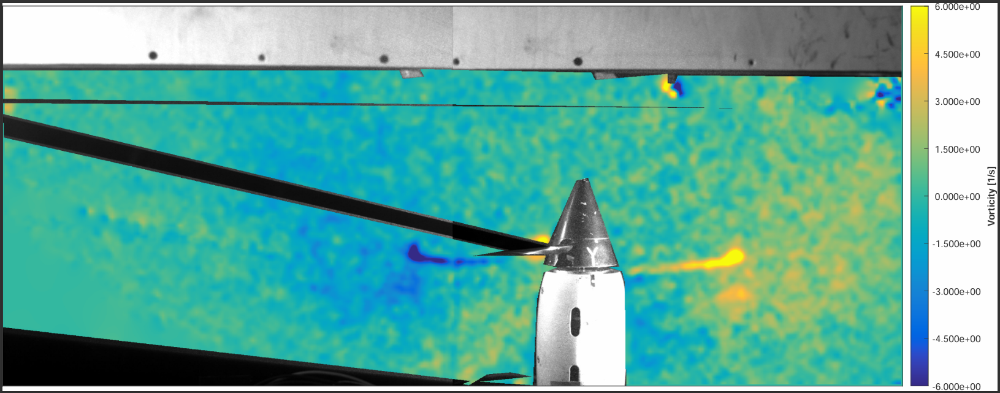

# PIV Simple Pass

[](https://matlab.mathworks.com/open/github/v1?repo=lucapiombo/PIV-SimplePass)

This repository contains a **MATLAB Live Script** that demonstrates the implementation and workflow of a **Simple Pass Particle Image Velocimetry (PIV)** algorithm. The script is designed to be both instructional and practical, guiding the user through each step of the PIV process from raw image input to final velocity field visualization.


## 📖 Purpose

The main objective of this project is to provide a clear, hands-on example of how a basic PIV algorithm works, focusing on single-pass cross-correlation, with real image data and calibration included.


## 🧭 What This Script Does

The `PIV_algorithm.mlx` script walks through the following stages:

1. **Spatial Calibration**  
   Uses reference images from a calibration grid to compute the pixel-to-physical scaling (magnification factor).

2. **Image Loading**  
   Loads a pair of experimental images from two synchronized cameras (Cam1 and Cam2) at two time steps.

3. **Pre-processing**  
   Applies filtering to improve image contrast and remove background noise.

4. **Mask Creation**  
   Uses a binary mask to exclude non-particle regions (e.g., walls or reflections).

5. **PIV Processing**  
   - Divides images into overlapping interrogation windows  
   - Uses cross-correlation to estimate local displacements  
   - Applies sub-pixel peak interpolation  
   - Converts displacements into velocity vectors

6. **Post-processing**  
   Filters spurious vectors using custom validation criteria.

7. **Visualization**  
   Displays the computed velocity field (and optionally vorticity) as vector plots.

---

Below an example of the a potential output image:



---

## ⚙️ Requirements

- MATLAB R2024a or newer
- **Image Processing Toolbox**


## 🚀 Getting Started

1. Clone this repository:
   ```bash
   git clone https://github.com/lucapiombo/PIV-SimplePas
2. Open `PIV_algorithm.mlx` and enjoy

---

Developed by Luca Piomboni
Feel free to open issues or contribute improvements!
